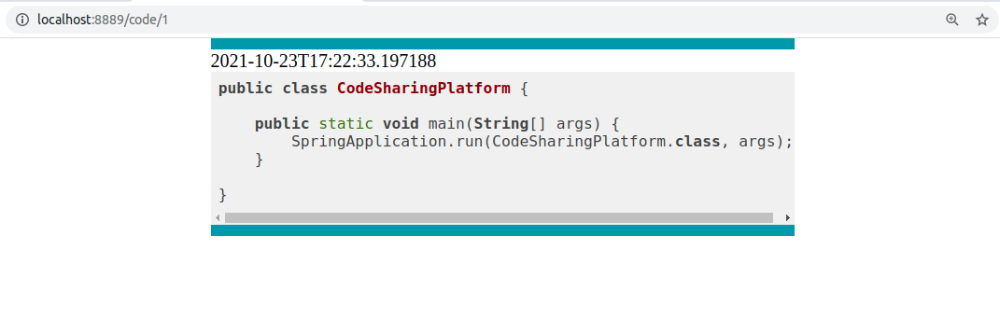
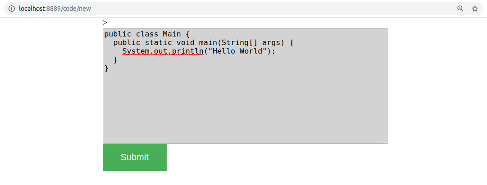
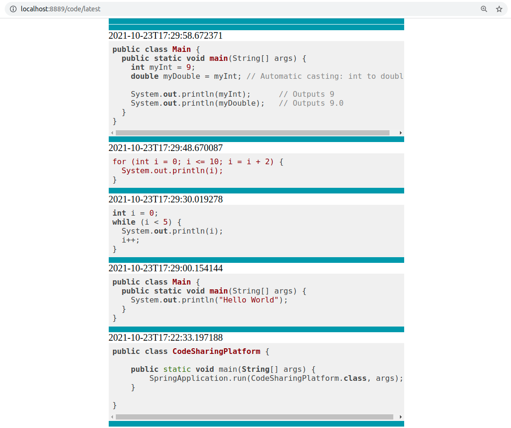

# Code Sharing Platform

## Table of Contents
1. [Description](#description)
2. [How to build and run](#build)
3. [Available endpoints](#endpoints)
4. [Important notes](#notes)

<div id="description">

## Description 

This is and application allowing users to share their code snippets with others. You can either use the web application or API enpoints to share and view the code.

<div id="build">

## How to build and run 

1. Clone the repository
2. Inside the repository run ```./gradlew build``` and then ```./gradlew run```

<div id="endpoints">

## Available endpoints 

- ```GET /code/{id}```- returns HTML that contains the code snippet with the specified id.

    **Example**

      

<br />
<br />

- ```GET /code/new```- returns a HTML that contains a form in witch you can paste your code and post it to the platform.

    **Example**

      

<br />
<br />

- ```GET /code/latest```- returns a HTML that contains 10 latest code snippets posted.

    **Example**

        

<br/>
<br/>

- ```GET /api/code/{id}```- returns a JSON with the code snippet of specified id.


    **Example**


    *GET /api/code/id*


    *Response:*
    
    ```json
    {
        "code": "public static void ...",
        "date": "2021-10-22T20:33:40.364042"
    } 
    ```

<br />
<br />

- ```POST /api/code/new``` - takes a JSON object with a single field ```code```, posts it to the platform and returns a JSON with an id the of posted snippet.


    **Example**
    
    *POST /api/code/new*
    ```json
    {
        "code": "class Code { ..." 
    }
    ```
    *Response:*
    
    ```json 
    {
        "id": "1"
    }   
    ```
<br />
<br />


- ```GET /api/code/latest```- returns a JSON array with 10 latest code snippets

    **Example** 
  

    *GET /api/code/latest*

    *Response:*
    ```json
    [
        {
            "code": "public static void ...",
            "date": "2020/05/05 12:00:43"
        },
        {
            "code": "class Code { ...",
            "date": "2020/05/05 11:59:12"
        },
        ...
    ]
    ```

<br />
<br />


<div id="notes">

## Important notes 

- **NOTE 1:** If you want to acces the database use ```/h2``` endpiont and login with credentials ```Login:admin```, ```Password:admin```.<br/>
- **NOTE 2:** Application work on ```http://localhost:8889``` by default. You can change the port in application.properties file.